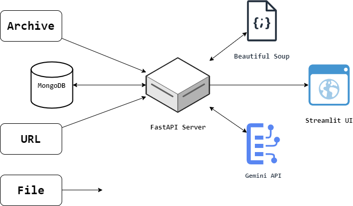

<p align="center">
  
</p>

## Project Description

The automated news feedback system uses web crawlers to create a dataset of news articles, scrape article URLs, and optical character recognition technology to extract content from e-papers. The system is built with the Streamlit framework to generate graphs using the Plotly library for visualization of scraped data.

Additionally, the system includes a chatbot (powered by Gemini API) that provides perspective on the latest news for users and a Chrome extension for real-time fake news detection.

## System Architecture

<p align="center">
  <strong>Data Acquisition</strong>
</p>

**Web Scraping**: Utilizes the `BeautifulSoup` library along with the `httpx` library to asynchronously scrape news articles from various news sources.

**File Scraping**: Utilizes the `PyTesseract` library for image-to-text conversion and the `PyMuPDF` library for PDF-to-text conversion.

---

<p align="center">
  <strong>Data Analysis</strong>
</p>

**Gemini API**: Provides sentiment analysis, media analysis, and fake news detection services. See [GEMINI_INTEGRATION.md](GEMINI_INTEGRATION.md) for detailed setup instructions.

**Database Storage**: Utilizes the `MongoDB` database to store responses from the Gemini API.

**User Authentication**: Secure user authentication system with JWT token-based sessions.

**Trend Analysis**: Historical analysis of news sentiment, topics, and misinformation trends.

**Comparative Analysis**: Side-by-side comparison of how different sources cover the same event.

---

<p align="center">
  <strong>Data Presentation</strong>
</p>

**User Interface**: Utilizes the `Streamlit` framework to generate graphs using the `Plotly` library for visualization of scraped data.

**Chrome Extension**: Provides real-time fake news detection on news articles (Manifest V3). Includes bookmark functionality to save and manage analyzed articles.

---

<p align="center">
  
</p>

## Getting Started

Follow these steps to set up and run the GodsEye software on your local machine, or you can watch the [demo video](https://youtube.com/watch?v=sWd4kOQU9as).

### Installation

1. Clone the repository to your local machine:

   ```shell
   git clone https://github.com/areebahmeddd/GodsEye.git
   ```

2. Navigate to the project directory:

   ```shell
   cd GodsEye
   ```

3. Create a virtual environment (optional but recommended):

   ```shell
   python -m venv .venv
   ```

4. Activate the virtual environment:

   - **Windows**:
     ```shell
     .venv\Scripts\activate
     ```
   - **macOS and Linux**:
     ```shell
     source .venv/bin/activate
     ```

5. Install the project dependencies:

   ```shell
   pip install -r requirements.txt
   ```

6. Set up the configuration files:

   - Create a `secrets.toml` file in the `.streamlit` directory with the following template:

   ```ini
   [admin]
   email = "your_email@example.com"
   app_pass = "your_app_password"

   [gemini]
   api_key = "your_gemini_api_key"
   ```

   - OR use our setup script to configure the Gemini API key:

   ```shell
   python setup_gemini_api.py
   ```
   This will guide you through getting and setting up a Gemini API key.

7. Set up the Chrome extension:
   - Open Chrome and go to `chrome://extensions`.
   - Enable "Developer mode" (top right corner).
   - Click "Load unpacked" (top left corner).
   - Select the `browser-extension` folder in the GodsEye repository.

### Usage

1. Launch the application by clicking the run button in the top right of VS Code, or execute:

   ```shell
   python python-app/app.py
   ```

2. Start the API server for the Chrome extension:

   ```shell
   python python-app/api_simple.py
   ```

3. To test the Chrome extension with a sample page:

   ```shell
   python setup_test_environment.py
   ```
   
   This will start both the API server and a test webpage server, opening a sample news article for testing.

4. Using the Browser Extension:

   - Navigate to any of the following supported websites:

     - https://www.ndtv.com
     - Or use the test page at http://localhost:8000/test_page.html

     **NOTE**: The subdomain https://www.ndtvprofit.com is currently unsupported due to a different HTML structure.

   - Select and open any article. The browser extension will be displayed on the right side of the screen. Click on the extension icon to access detailed information.

5. For Contributors:
   - To apply changes made to the browser extension, visit `chrome://extensions`, click the "Update" button at the top left, and reload the article page to see the updates.
   - See the detailed extension guide in `EXTENSION_GUIDE.md` for more information.

## License

This project is licensed under the [Apache License 2.0](https://github.com/areebahmeddd/GodsEye/blob/main/LICENSE).

## Authors

[Areeb Ahmed](https://github.com/areebahmeddd) and [Shivansh Karan](https://github.com/SpaceTesla)
